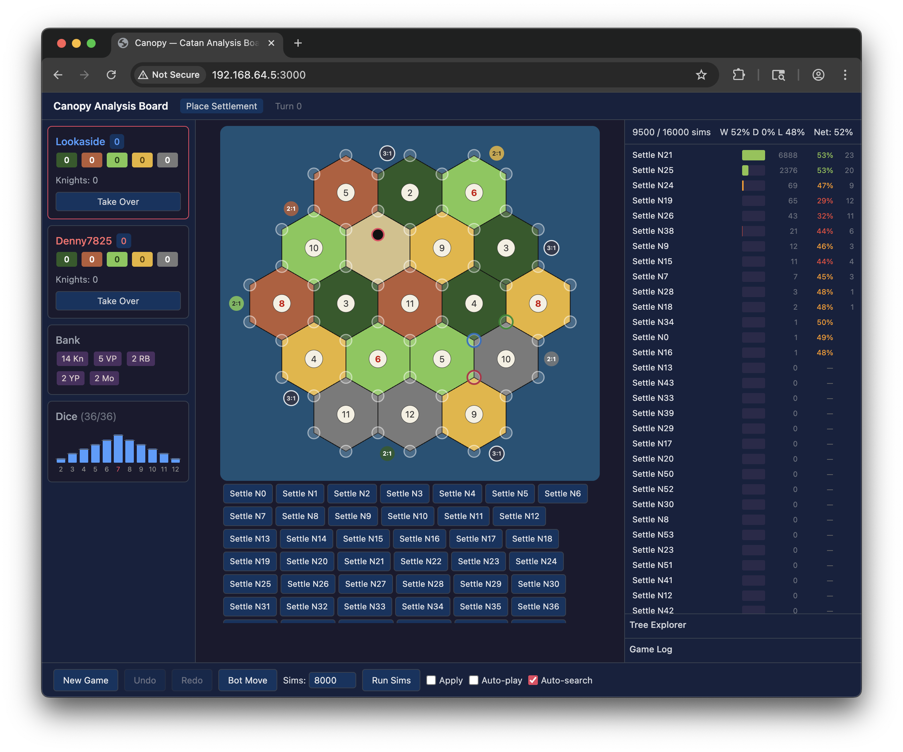

# HexFish

Implement a small `Game` trait and a tensor encoder; HexFish gives you
PUCT MCTS, neural self-play, a training loop, a tournament runner, and
a web analysis board. Targets single-machine training (no distributed
or networked setup).



## Supported games

- **One or two players.** Two-player games are zero-sum; single-player
  games express themselves as "always maximizer" via
  `Status::Decision(+1.0)`. Three- and four-player games are not
  supported today — `Status` would need to carry a player index rather
  than a ±1 sign.
- **Deterministic or stochastic.** Chance nodes (dice, shuffles) are
  first-class: `select` samples outcomes internally during descent, no
  evaluation needed.
- **Perfect or imperfect information.** Hidden information is handled
  via Single-Observer ISMCTS: `determinize()` resamples before each
  simulation, and search filters tree edges against the determinized
  legal action set during descent.

## The interface

```rust
pub trait Game: Clone + Send + Sync {
    const NUM_ACTIONS: usize;
    fn status(&self) -> Status;
    fn legal_actions(&self, buf: &mut Vec<usize>);
    fn apply_action(&mut self, action: usize);

    // Optional:
    fn state_key(&self) -> Option<u64> { None }               // transpositions
    fn chance_outcomes(&self, buf: &mut Vec<(usize, u32)>) {} // stochastic games
    fn sample_chance(&self, rng: &mut fastrand::Rng) -> Option<usize>;
    fn determinize(&mut self, rng: &mut fastrand::Rng) -> bool { false } // SO-ISMCTS
}

pub enum Status {
    Decision(f32),   // +1 maximizer, −1 minimizer
    Chance,
    Terminal(f32),   // reward from P1 perspective
}
```

Four required methods plus opt-in hooks for transpositions, chance
nodes, and imperfect information. See
[`src/game.rs`](src/game.rs) for the full trait.

## Running an example

```
cargo run --example pig -- -n 20                             # tournament
cargo run --example pig --features nn -- train --iterations 5 # train from scratch
```

Example games live in [`examples/`](examples/). The biggest is 1v1
Catan — see [1v1 Catan](#1v1-catan) below.

## Running the web UI with Docker

The Docker image serves the 1v1 Catan web analysis board described
below, using the built-in `rollout` evaluator and exposing the board on
port 3000:

Rebuild the image so the Rust server changes are included:

```
docker compose up --build
```

The server chooses its port in this order: an explicit `--port`, the
`PORT` environment variable, then local default `3000`. This keeps
`docker compose` available at <http://localhost:3000> while allowing
Cloud Run to inject its required port.

WebSocket sessions use a browser-local anonymous session id. The frontend
can still require Clerk sign-in before showing the app, but the server no
longer validates Clerk JWTs or depends on Clerk server environment variables.

Replay logs are stored in Postgres when `DATABASE_URL` is set. The
included `docker-compose.yml` starts a local Postgres service and wires
`DATABASE_URL` automatically; without `DATABASE_URL`, the server falls
back to local replay log files.

For production, set `HEXFISH_REPLAY_STORE_REQUIRED=true` so the server
fails startup if Postgres replay storage cannot connect. Leave it unset
or `false` for local development so filesystem replay logs remain a
fallback.

Then open <http://localhost:3000>.

## Cloud Run + Cloud SQL replay storage

Use these defaults for a fresh production Cloud SQL setup: `REGION=us-central1`,
`INSTANCE=hexfish-postgres`, `DATABASE=hexfish`, `DB_USER=hexfish_app`,
and `SECRET=hexfish-database-url`. This starts with an empty replay
database; existing Docker Postgres replay data is not imported.

Run from Cloud Shell or any terminal with `gcloud` authenticated:

```bash
PROJECT_ID="PROJECT_ID"
SERVICE_NAME="SERVICE_NAME"
REGION="us-central1"
INSTANCE="hexfish-postgres"
DATABASE="hexfish"
DB_USER="hexfish_app"
SECRET="hexfish-database-url"

gcloud config set project "$PROJECT_ID"
gcloud services enable run.googleapis.com sqladmin.googleapis.com secretmanager.googleapis.com
PROJECT_NUMBER="$(gcloud projects describe "$PROJECT_ID" --format='value(projectNumber)')"
CONNECTION_NAME="$PROJECT_ID:$REGION:$INSTANCE"
DB_PASSWORD="$(openssl rand -base64 32)"

gcloud sql instances create "$INSTANCE" \
  --database-version=POSTGRES_16 \
  --region="$REGION" \
  --availability-type=ZONAL \
  --tier=db-f1-micro \
  --storage-type=SSD \
  --storage-size=10GB \
  --storage-auto-increase \
  --backup-start-time=03:00 \
  --enable-point-in-time-recovery \
  --deletion-protection

gcloud sql databases create "$DATABASE" --instance="$INSTANCE"
gcloud sql users create "$DB_USER" --instance="$INSTANCE" --password="$DB_PASSWORD"

printf "host=/cloudsql/%s port=5432 dbname=%s user=%s password=%s sslmode=disable" \
  "$CONNECTION_NAME" "$DATABASE" "$DB_USER" "$DB_PASSWORD" \
  | gcloud secrets create "$SECRET" --data-file=-
# If the secret already exists, add a new version instead:
# printf "host=/cloudsql/%s port=5432 dbname=%s user=%s password=%s sslmode=disable" \
#   "$CONNECTION_NAME" "$DATABASE" "$DB_USER" "$DB_PASSWORD" \
#   | gcloud secrets versions add "$SECRET" --data-file=-

SERVICE_ACCOUNT="$(gcloud run services describe "$SERVICE_NAME" \
  --region="$REGION" \
  --format='value(spec.template.spec.serviceAccountName)')"
if [ -z "$SERVICE_ACCOUNT" ]; then
  SERVICE_ACCOUNT="$PROJECT_NUMBER-compute@developer.gserviceaccount.com"
fi

gcloud projects add-iam-policy-binding "$PROJECT_ID" \
  --member="serviceAccount:$SERVICE_ACCOUNT" \
  --role="roles/cloudsql.client"
gcloud secrets add-iam-policy-binding "$SECRET" \
  --member="serviceAccount:$SERVICE_ACCOUNT" \
  --role="roles/secretmanager.secretAccessor"

gcloud run services update "$SERVICE_NAME" \
  --region="$REGION" \
  --add-cloudsql-instances="$CONNECTION_NAME" \
  --set-secrets="DATABASE_URL=$SECRET:latest" \
  --set-env-vars="HEXFISH_REPLAY_STORE_REQUIRED=true"
```

After the new revision starts, save a replay, list replays, favorite it,
open the share link, and confirm rows exist in `replay_logs`. Keep the
previous Cloud Run revision available until those checks pass.

## What you get

- **PUCT MCTS** with Dirichlet noise at the root and the
  improved-policy formula from Gumbel AlphaZero
  (`softmax(logit + σ(completedQ))`) at interior nodes. Chance nodes
  are handled internally during descent.
- **Self-play training loop** — parallel self-play workers feed a
  replay buffer; the trainer produces checkpoints; evaluators swap in
  without stopping workers.
- **Batched inference** — the search module is a state machine.
  Callers pull leaves via `select`, batch evaluations, then push
  results back via `backup` / `backup_terminal`. Leaves from many
  concurrent searches combine into one GPU forward pass. Virtual loss
  on in-flight edges keeps parallel threads on different leaves.
- **Transpositions** — `state_key() -> Option<u64>` opts a game in;
  action sequences reaching the same state share a DAG node.
- **Tree reuse across moves** — `apply_action` reroots and compacts
  in O(reachable nodes) rather than rebuilding.
- **Tournament harness** — head-to-head config comparisons,
  round-robin, game-log replay.
- **Web analysis board** — WebSocket server streams live tree state
  to a browser (behind the `server` feature).

## 1v1 Catan

The biggest example, and the one most of the framework's design
decisions were tuned against. We believe the `nexus-v3` checkpoint
below is the strongest public 1v1 Catan agent. The example plays
against live colonist.io games over CDP and ships with a web analysis
board.

- Checkpoint: [catan-nexus-v3 release](https://github.com/cullback/hexfish/releases/tag/catan-nexus-v3)
- Details: [examples/catan/README.md](examples/catan/README.md)

## Differences from the Gumbel AlphaZero paper

Interior-node selection and the improved-policy training target
follow Danihelka et al. (ICLR 2022). Root selection and several
practical details differ:

1. **PUCT at the root** — `Q + c_puct · P · √N_parent / (1 + N)` with
   Dirichlet noise on priors, rather than Gumbel-Top-k + Sequential
   Halving.
2. **Transposition table** — state deduplication via `state_key()` /
   DAG structure. Paper doesn't address transpositions.
3. **Tree reuse between moves** — `apply_action` + compact preserves
   reachable subtrees.
4. **Arena-based tree** — contiguous node and edge storage with
   integer `NodeId` indices instead of pointers.
5. **Value target z/q blending** — training target `(1−α)z + α·q` with
   a linear ramp. Paper uses `z` (game outcome) alone. Matters for
   stochastic games with high outcome variance.
6. **Chance node support** — extends the algorithm to stochastic
   games. Paper is perfect-information only.
7. **Path-only Q-bound tracking** — warmup emerges naturally: bounds
   stay tight early (trust policy) and widen as Q values accumulate
   (trust Q). Paper uses full-tree bounds.
8. **Forced action skipping** — single-legal-action states bypass
   MCTS.

## Contributing

Community contributions are welcome. The goal is to keep HexFish a
general framework for training AlphaZero-style agents — a minimal
interface that any game implementer can target to get working search
and training for free.

Particularly interested in:

- **API ergonomics.** The `Game` trait, the `select` / `backup` state
  machine, the training loop config — if something felt awkward to
  implement against, that's a signal. Aggressive refactoring proposals
  welcome.
- **Training throughput.** Faster batching, better GPU utilization,
  lower-overhead self-play, smarter replay buffer strategies.
- **State-of-the-art techniques.** KataGo-style auxiliary heads, more
  efficient value-target schedules, better exploration, improved
  determinization strategies for imperfect-information games.
- **New games.** Anything that exercises a corner of the framework
  (new action-space shapes, chance structures, information models)
  surfaces rough edges.
- **Catan bot.** Stronger network architectures, better feature
  encodings, search improvements specific to Catan, self-play tuning.
  The [catan-nexus-v3](https://github.com/cullback/hexfish/releases/tag/catan-nexus-v3)
  checkpoint is the current baseline to beat.
- **Multi-player generalization.** Extending `Status::Decision` and
  the training targets to 3+ player non-zero-sum games is an open
  direction — non-trivial but high-value.

Open an issue to discuss larger changes before writing code.

## Further reading

- [`METHODS.md`](METHODS.md) — search architecture, design decisions,
  and future ideas in one document.
- [`src/train/README.md`](src/train/README.md) —
  parameter-by-parameter guide for tuning a training run.
- [`examples/catan/OPTIMIZATIONS.md`](examples/catan/OPTIMIZATIONS.md)
  — Catan-specific tree and action-space optimizations.

## References

- <https://suragnair.github.io/posts/alphazero.html>
- <https://davidstarsilver.wordpress.com/wp-content/uploads/2025/04/gumbel-alphazero.pdf>
- <https://medium.com/oracledevs/lessons-from-implementing-alphazero-7e36e9054191>
- <https://brantondemoss.com/writing/kata/>
- <https://gwern.net/doc/reinforcement-learning/model/alphago/2017-silver.pdf#page=5>
- <https://github.com/lightvector/KataGo/blob/master/docs/KataGoMethods.md>
- [Enhancements for Real-Time Monte-Carlo Tree Search in General Video Game Playing (2024)](https://arxiv.org/html/2407.03049v1)
- [cosine learning rate](https://medium.com/@utkrisht14/cosine-learning-rate-schedulers-in-pytorch-486d8717d541)

Related repos

- <https://github.com/google-deepmind/mctx>
- <https://github.com/gorisanson/quoridor-ai>
- <https://github.com/Aenteas/MCTS>
- <https://github.com/hzyhhzy/KataGomo>
